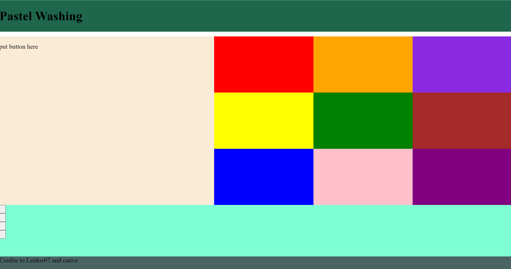
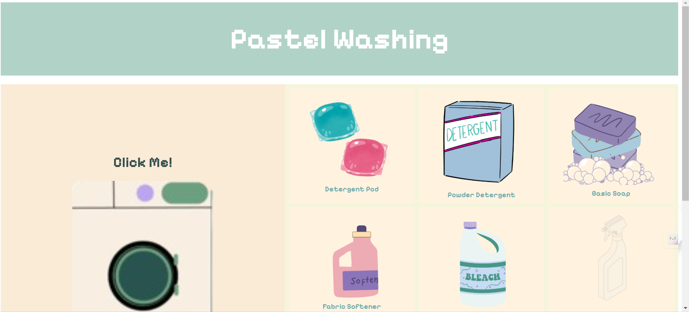

# Daring Debugging: Fixing Python Code One Bug at a Time

Debugging code isn’t exactly what I’d call a fun time. Let’s be real — when you’re just starting out with Python, it can feel like the language is actively working against you. But when you do manage to figure out what’s broken, it’s one of those “light bulb over the head” moments that makes the struggle worth it.

For this assignment, I had to go through a bunch of Python code snippets, spot what was wrong, and fix them. Spoiler: some of these bugs were easy to miss, but I got there in the end.

---

## 1. Temperature Check Gone Wrong
The first bit of code was supposed to tell you if it was hot, temperate, or cold outside. Sounds easy enough, right? Well, not when the code ignores an entire range of temperatures like it’s no big deal.

**Original Code**:
```python
temperature = 75

if temperature > 80:
    print("It's hot")
elif temperature > 50:
    print("It's temperate")
elif temperature < 0:
    print("It's cold")


# Pastel Washing; Learning JavaScript to Make a Simple Game


The name ‘Pastel Washing’ kinda sucks. Its the name of a game I made for a school assignment.  The name was originally supposed to be  something along the lines of “Bub’s Bubbly Machinery” but my name isn't Bub and I don't know Bub. Coding with JavaScript (when you're a beginner)  also sucks — especially when you're easily confused by the  multiple contradictions of data that you have to check for. And yet the ability to actually learn things pulled through and made the clicker one of the more enjoyable projects to build.

The first part of this project was obviously planning.

 I already knew I was creating a clicker game(via teacher’s instructions) but had no idea what the theme of the games should be. Before this project, the only clicker game I knew of was Cookie Clicker. Because of this I first considered a Bakery, thought it would be unoriginal and pivoted to a cult theme because I had just finished the main story of cult of the lamb but decided it was  too raunchy for a school project. I eventually thought of a laundry theme because it is the only chore I enjoy doing.

 This Next part was planning the attributes of the game. I decided the  button the players would click  on was a giant  washing machine.I also decided on the following attributes for the tool players could use.

            detergentPod: "Increases score by 1 every 3 seconds",

            powderDetergent: "Increases score by 7 every 10 seconds",

            basicSoap: "Increases score by 2 every 5 seconds",

            fabricSoftener: "Increases score by 5 every 7 seconds",
            
            bleach: "Increases score by 10 every 15 seconds",

            stainRemover: "Increases score by 15 every 20 seconds",

            scentBooster: "Increases score by 20 every 25 seconds",

            washingMachineCleaner: "Increases score by 25 every 30 seconds",

            dryerSheets: "Increases score by 30 every 35 seconds"


Then, I decided on the color scheme. At first, I considered using  a neon color scheme ,however, it  seemed to loud for the calm vibe I wanted  for the game. Because of this, I  one a mostly beige color scheme with pops of purple green and minty blue to make sure the game wasn't too bland. 

I created a collage on canva to give myself a  loose idea of what I wanted the game to look like.

To start the project, I used a  Css grid layout generator https://grid.layoutit.com/ to automatically generate the code for the game’s layout. 



To create the icons for the the game’s buttons I started drawing on  the  Procreate editor app but drawing the art  well enough to use ass icons. I started using Canva to find visuals suitable for game buttons and make minor adjustment to color and size. Next I  created the game buttons by using the  button class  in the specific section of the grid layout I created.

Once the layout was ready and the visuals were in place, I started with the actual game mechanics. This was where things got a bit tricky because while I had a clear vision of what I wanted the game to look like, translating that into functional code was a whole different story.

To implement the game logic, I used JavaScript (as instructed), which I was still not completely familiar with. I started with the most essential part of the game: the score counter. 

I wrote a simple function that would update the score each time the washing machine was clicked:

    function startItemTimer(item) {
     if (itemTimers[item]) clearInterval(itemTimers[item]);
      itemTimers[item] = setInterval(() => {
         score += itemIncrements[item];
         document.getElementById('score').innerText = 
         `Score: ${score}`;
    }, itemIntervals[item]);
    }

With this code, the timers would kick in whenever a player bought an item. It took some trial and error (and a lot of random bugs), but I eventually got it working.

After the mechanics were in place, I focused on making the game more user-friendly. I added tooltips to show players what each item did and how much it cost. If you hovered over a button, you’d see something like “Detergent Pod - Price: 10 - Increases score by 1 every 3 seconds.” This made it easier to decide which items to buy and added a bit of strategy to the game.

I also used some background music using Howler.js and created a mute button. It was a small touch but made the game feel more complete.


      let bgMusic = new Howl({
         src: ['Viktor Kraus - Blueberries.mp3'],
        autoplay: true,
        volume: 0.10,
        loop: true
            });
    function muteMusic() {
        bgMusic.pause();
            }

By the end, Pastel Washing was a functional clicker game with a chill laundry theme. It was a fun project that taught me a lot about JavaScript, CSS, and why I should always have a backup plan for bugs. While it’s far from perfect, building it was more enjoyable than I thought it’d be.

Would I choose a different name if I did it again? Absolutely. But for now, I’m happy with what I’ve created — bugs, confusing code, and all.            


